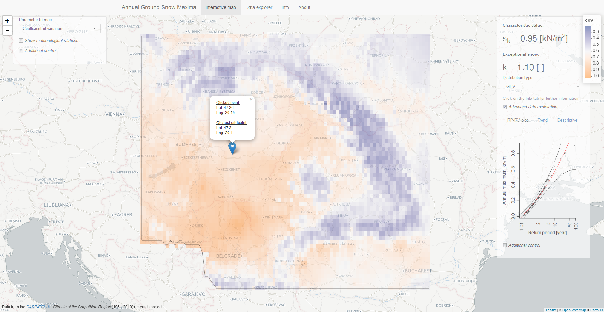

Interactive snow map
====================

Interactive snow map for the Carpathian region - with structural engineering focus

__Codes:__ R

[Online, running instance.](http://hsz121.hsz.bme.hu:3838/shinyapp_snow_map/)

  
Acknowledgements
----------------

The scripts in this repo have been developed at [Department of Structural Engineering](http://www.epito.bme.hu/hidak-es-szerkezetek-tanszek), Budapest University of Technology and Economics.
The data are from the [CARPATCLIM](http://www.carpatclim-eu.org/pages/home/): Climate of the Carpathian Region (1961-2010) research project.