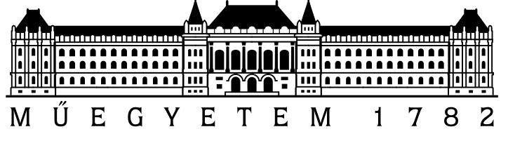

***

__In the spirit of reproducible and open research the source code of this application is fully disclosed (<a href="???" target="_blank">GitHub</a>).__

Licence: <a href="https://tldrlegal.com/license/mit-license" target="_blank">MIT Licence</a>

  
<a href="http://www.bme.hu/" target="_blank">Budapest University of Technology and Economics</a>  
<a href="http://www.hsz.bme.hu/hsz/index.php" target="_blank">Department of Structural Engineering</a>

***

__The app is inspired by:__
* <a href="http://shiny.rstudio.com/gallery/superzip-example.html" target="_blank">Superzip</a>, code snippets are borrowed to build this shiny app,
* <a href="http://www.snehovamapa.cz/" target="_blank">Digital snow map for the Czech Republic</a>.

__Used R packages:__ 
<a href="http://shiny.rstudio.com/" target="_blank">shiny</a>,
<a href="http://yihui.name/knitr/" target="_blank">knitr</a>,
<a href="http://rmarkdown.rstudio.com/" target="_blank">rmarkdown</a>,
<a href="https://rstudio.github.io/leaflet/" target="_blank">leaflet</a>,
<a href="https://cran.r-project.org/web/packages/dplyr/index.html" target="_blank">dplyr</a>,
<a href="https://cran.r-project.org/web/packages/sp/index.html" target="_blank">sp</a>,
<a href="https://cran.r-project.org/web/packages/raster/index.html" target="_blank">raster</a>,
<a href="https://cran.r-project.org/web/packages/FAdist/index.html" target="_blank">FAdist</a>,
<a href="https://cran.r-project.org/web/packages/bbmle/index.html" target="_blank">bbmle</a>.

Created by: Árpád Rózsás

 Contact: 

